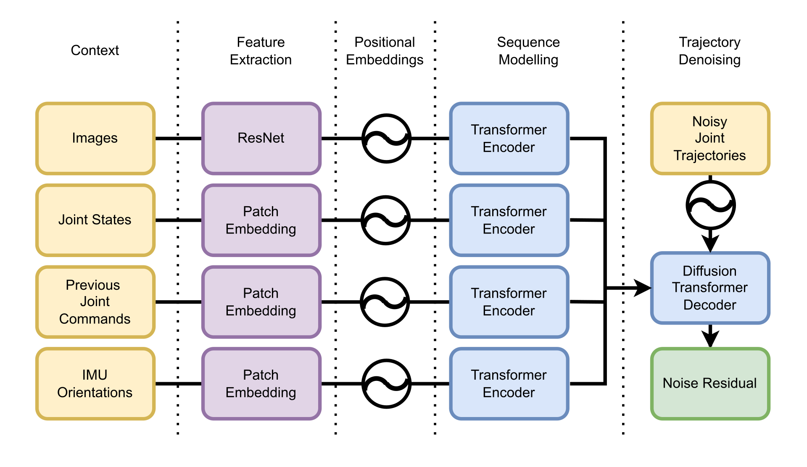

  <a href="#" style="
    display: inline-block;
    padding: 12px 24px;
    margin: 6px;
    font-size: 18px;
    font-weight: bold;
    color: white;
    background-color: #6c757d;
    border-radius: 8px;
    text-decoration: none;
  ">📄 Paper</a>

  <a href="https://github.com/bit-bots/SoccerDiffusion" style="
    display: inline-block;
    padding: 12px 24px;
    margin: 6px;
    font-size: 18px;
    font-weight: bold;
    color: white;
    background-color: #007bff;
    border-radius: 8px;
    text-decoration: none;
  ">💻 Code</a>

  <a href="https://data.bit-bots.de/soccer_diffusion_dataset.sqlite3" style="
    display: inline-block;
    padding: 12px 24px;
    margin: 6px;
    font-size: 18px;
    font-weight: bold;
    color: white;
    background-color: #28a745;
    border-radius: 8px;
    text-decoration: none;
  ">🗃️ Dataset</a>

## Walking
<video width="100%" data-src="assets/walking.mp4" controls muted loop autoplay playsinline>
</video>

## Fall and Standup

## Architecture

