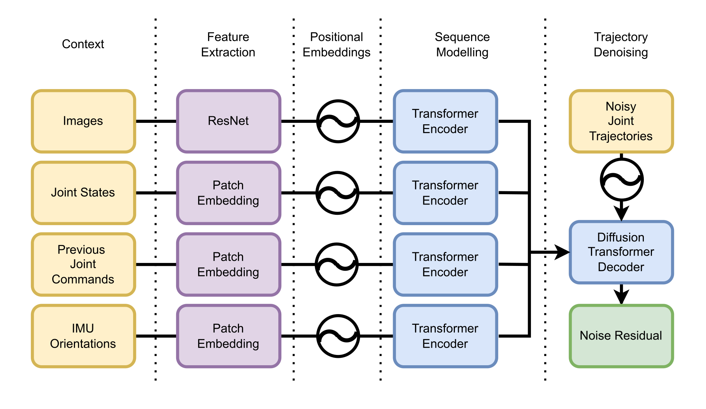

> **Florian Vahl**, **Jörn Griepenburg**, **Jan Gutsche**, **Jasper Güldenstein**, and **Jianwei Zhang**
>
> *University of Hamburg, Germany*

<p align="center">
    <a href="https://arxiv.org/pdf/2504.20808" aria-label="Download the paper" title="Download the paper" style="
        display: inline-block;
        padding: 12px 24px;
        margin: 6px;
        font-size: 18px;
        font-weight: bold;
        color: white;
        background-color: #6c757d;
        border-radius: 8px;
        text-decoration: none;
    ">📄 Paper</a>
    <a href="https://github.com/bit-bots/SoccerDiffusion" aria-label="View the source Code on GitHub.com" title="View the source Code on GitHub.com" style="
        display: inline-block;
        padding: 12px 24px;
        margin: 6px;
        font-size: 18px;
        font-weight: bold;
        color: white;
        background-color: #007bff;
        border-radius: 8px;
        text-decoration: none;
    ">💻 Code</a>
    <a href="#dataset" aria-label="Download the dataset" title="Download the dataset" style="
        display: inline-block;
        padding: 12px 24px;
        margin: 6px;
        font-size: 18px;
        font-weight: bold;
        color: white;
        background-color: #28a745;
        border-radius: 8px;
        text-decoration: none;
    ">🗃️ Dataset</a>
</p>

## Abstract

This paper introduces *SoccerDiffusion*, a transformer-based diffusion model designed to learn end-to-end control policies for humanoid robot soccer directly from real-world gameplay recordings.
Using data collected from RoboCup competitions, the model predicts joint command trajectories from multi-modal sensor inputs, including vision, proprioception, and game state.
We employ a distillation technique to enable real-time inference on embedded platforms that reduces the multi-step diffusion process to a single step.
Our results demonstrate the model’s ability to replicate complex motion behaviors such as walking, kicking, and fall recovery both in simulation and on physical robots.
Although high-level tactical behavior remains limited, this work provides a robust foundation for subsequent reinforcement learning or preference optimization methods.

## Walking

<video width="100%" src="assets/walk.mp4" controls muted loop autoplay playsinline></video>

## Fall and Standup

<video width="100%" src="assets/get_up_fall_back.mp4" controls muted loop autoplay playsinline ></video>

<video width="100%" src="assets/get_up_fall_right.mp4" controls muted loop autoplay playsinline ></video>

<video width="100%" src="assets/get_up_fall_front.mp4" controls muted loop autoplay playsinline ></video>

## Architecture



## Dataset

The dataset file is compressed using gzip.
You can get the dateset in two ways:

1. **Download and immediately uncompress dataset** with:

    ```shell
    wget https://data.bit-bots.de/SoccerDiffusion/dataset/robocup_2024_german_open_2025.sqlite3.gz -O - | gzip -d > robocup_2024_german_open_2025.sqlite3
    ```

2. **Download the compressed dataset, then uncompress**: [robocup_2024_german_open_2025.sqlite3.gz](https://data.bit-bots.de/SoccerDiffusion/dataset/robocup_2024_german_open_2025.sqlite3.gz) and uncompress file manually with:

    ```shell
    gzip -d robocup_2024_german_open_2025.sqlite3.gz
    ```
---

**File:** `robocup_2024_german_open_2025.sqlite3.gz`  
**Size:** 266 GB  
**SHA256SUM:**  
`21ba0fe6ff39298f678bb59b2f85e6cfa5351d77d0695f73d9f4bb69a2427d7c`  
**MD5SUM:**  
`ecd6b5a5adeef7a688e281afe7fa91c8`

---

**File:** `robocup_2024_german_open_2025.sqlite3`  
**Size:** 340 GB  
**SHA256SUM:**  
`c39d10b9c5533f8d04a2c58e3d522b2134cda7fe64e9eabca9363c9ebfd2b1e4`  
**MD5SUM:**  
`de6997b4f18e701e3d7730e3e1151ae2`

---


## Acknowledgements

We gratefully acknowledge funding and support from the project [*Digital and Data Literacy in Teaching Lab (DDLitLab)*](https://www.hcl.uni-hamburg.de/ddlitlab.html) at the University of Hamburg and the [*Stiftung Innovation in der Hochschullehre*](https://stiftung-hochschullehre.de/) foundation.
We extend our special thanks to the members of the [*Hamburg Bit-Bots*](https://bit-bots.de/) RoboCup team for their continuous support and for providing data and computational resources.
We also thank the RoboCup teams [*B-Human*](https://b-human.de/) and [*HULKs*](https://hulks.de/) for generously sharing their data for this research.
Additionally, we are grateful to the [*Technical Aspects of Multimodal Systems (TAMS)*](https://tams.informatik.uni-hamburg.de/) research group at the University of Hamburg for providing computational resources.
This research was partially funded by the Ministry of Science, Research and Equalities of Hamburg, as well as the German Research Foundation (DFG) and the National Science Foundation of China (NSFC) through the project [*Crossmodal Learning*](https://www.crossmodal-learning.org/home.html) (TRR-169).
