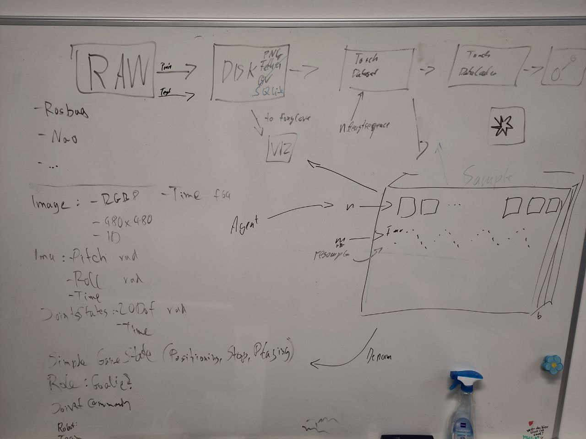

# Dataset

- split into training, test, validation set

# Pipeline

1. Raw Data
    - rosbags
    - Nao data
    - ...
2. Disk storage 
    - png
    - csv
    - ...
3. Torch Dataset
    - loads the disk stored data
4. Torch Dataloader
    - loads the dataset in batches of samples

## Raw Data

Use bitbots standard fore all data.

- Images from the cameras
  - Transform to RGB 8bit
  - Resize to squared images (e.g. 480x480)
  - Camera id for NAOs
- IMU
  - filtered pitch, roll in radians
  - use bitbots coordinate systems
- Joint states (angles)
  - 20 degrees of freedom (Wolfgang-OP)
  - use bitbots naming of joints
  - for NAO split hip joints into left and right
- Simplified game state
  - Positioning, Stop, Playing
  - Role (goalie, player)
- Joint commands (angles)
  - 20 degrees of freedom (Wolfgang-OP)
  - use bitbots naming of joints
  - for NAO split hip joints into left and right
- Time for each data in seconds, since start of recording (float)

## Disk storage

- Add metadata
  - when was it recorded
  - where is the data from
  - what robot was used
  - team color
- store as sqlite database
  - table for each data type
  - table for metadata
  - save images as blobs

## Torch Dataset

- maybe convert sqlite to pandas to prevent conversion to python `int`, `float`, etc data types
- iterator of samples
  - how many items of different types per sample (e.g. 6 imgs, 3 joint states, ...)
  - normalized scaled time `0..1` of item in sample
  - fixed number of images
  - overlapping samples (all permutations of images)
  - normalization of all data types
  - specific normalization/representation to be defined

# Ideas

- visualization in `foxglove-studio` and with `matplotlib`
- hyperparameter optimization
    - batch sizes
    - learning rates
    - item counts per sample
